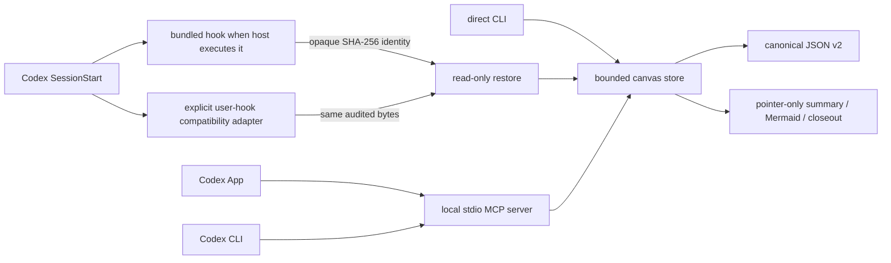

# Context Canvas for Codex App and CLI

`context-canvas-codex` is a local, evidence-pointer-only task map for work that
must survive resume and context compaction without copying transcripts, logs, or
evidence contents into another store. The plugin packages one read-only
`SessionStart` hook, a persistent stdio MCP server, a CLI, and a bounded local
store.

The design was compared with
[`phenomenoner/hermes-agent-harness-plus`](https://github.com/phenomenoner/hermes-agent-harness-plus)
at commit `7d6beb485d658a0342194c0e42edcdb7106ed1cb`. This is a clean Codex
adaptation; no Hermes source code is copied.

## Capability alignment

| Concern | Hermes Context Canvas | Codex adaptation |
|---|---|---|
| Task identity | Harness-owned session identity | SHA-256 of the trusted Codex `SessionStart.session_id`; workspace paths are metadata only |
| Durable state | Canonical JSON plus state/events/projections | Canonical JSON v2 plus on-demand summary, Mermaid, search, and Markdown closeout |
| Factual integrity | Factual nodes point to evidence | Terminal factual states require one or more pointer + SHA-256 pairs |
| Updates | Add and mutate task facts | Idempotent upsert, explicit status transition, and bounded dependency edges |
| Search | Canvas and reference search | Bounded metadata-only substring search across at most 256 canvases; corrupt canvases are reported and skipped |
| Native tools | Harness MCP tools | Six local `canvas_*` MCP tools shared by Codex App and CLI |
| Concurrency | Process/thread locking plus atomic state writes | Cross-process Windows/POSIX lock plus atomic canonical replacement |
| Automatic capture | In-process autopilot can select tool results | Intentionally omitted; the Codex plugin never captures tool input/output or parses transcripts |

The omitted autopilot is an authority and latency boundary, not a missing
shortcut. A Codex `PostToolUse` hook can receive tool inputs and responses, and
a command hook starts another process for every matching event. The adapter
therefore keeps checkpoints explicit and uses a persistent MCP process for
repeated operations.

## Runtime shape



The default data root is `%LOCALAPPDATA%\Codex\context-canvas-codex`. Plugin
source and runtime data are separate: this repository publishes the source but
never exports canvas data, evidence targets, local caches, or hook receipts.

At `startup` and `clear`, the hook returns only the opaque ID and a short usage
hint. At `resume` and `compact`, it can inject up to 4,800 UTF-8 bytes containing
the active goal, blockers, decisions/findings, and latest verification. Stored
text and pointers are always labeled untrusted.

Plugin packaging and lifecycle execution are separate runtime claims. Codex's
plugin documentation defines bundled hooks, but an open Codex runtime issue
tracks builds that discover plugin skills and MCP servers without running the
bundled hook. That behavior was reproduced locally with CLI 0.146.0. The
included installer therefore registers the same script in the supported
user-level `hooks.json` layer only when a fresh-task probe shows that the
bundled path did not execute. See the official
[plugin hook documentation](https://developers.openai.com/plugins/build/plugins)
and [Codex issue #16430](https://github.com/openai/codex/issues/16430).

## Schema and invariants

Schema v2 supports these node kinds:

- Factual: `goal`, `blocker`, `decision`, `verification`, `finding`, `action`.
- Non-factual: `plan`, `question`, `assumption`.

Statuses are `active`, `blocked`, `done`, `superseded`, `verify`, `planned`,
`doing`, and `deprecated`. A factual node entering `blocked`, `done`,
`superseded`, `verify`, or `deprecated` must carry a hash-bound evidence
pointer. A node may carry at most eight evidence references and sixteen
dependencies. Self-links, duplicates, missing nodes, and dependency cycles fail
closed.

Legacy v1 canvases are converted only in memory for a read. The first explicit
mutation persists canonical v2 bytes, so a restore hook never rewrites old
state merely by observing it.

## MCP and CLI surfaces

The bundled server exposes:

- `canvas_start`
- `canvas_upsert_node`
- `canvas_set_status`
- `canvas_read`
- `canvas_search`
- `canvas_closeout`

It uses newline-delimited JSON-RPC over stdin/stdout and has no network
listener. Empty resource and resource-template responses support Codex host
discovery without exposing canvas state as MCP resources. The CLI reaches the
same store:

```powershell
python -I scripts/context_canvas.py init --canvas-id <opaque-id> --goal "Bounded goal" --cwd <absolute-workspace>
python -I scripts/context_canvas.py upsert --canvas-id <opaque-id> --kind plan --status planned --summary "Inspect the boundary"
python -I scripts/context_canvas.py search "boundary" --canvas-id <opaque-id>
python -I scripts/context_canvas.py closeout --canvas-id <opaque-id> --no-write
```

For repeated App or CLI operations, prefer MCP because the persistent process
can reuse verified local security metadata. Direct CLI calls remain useful for
recovery and inspection when MCP is unavailable.

MCP approval is independent of shell approval. In particular,
`approval_policy = "never"` cancels a call that still requires MCP approval.
After reviewing all six local tools, a non-interactive acceptance probe can set
the installed plugin's server policy explicitly:

```powershell
codex exec `
  -c 'plugins."context-canvas-codex@codex-app-plus".mcp_servers.context-canvas.default_tools_approval_mode="approve"' `
  '<bounded Context Canvas acceptance prompt>'
```

This grants the plugin's local write tools for that invocation. Keep the
override scoped, and judge success only from completed MCP tool calls plus a
readback of the canonical store. A cancelled or merely started event proves
nothing was committed.

## Security boundaries

- Evidence pointers are never opened, fetched, copied, or executed.
- The plugin has no connector, network client, transcript parser, background
  task, or `PostToolUse` capture.
- Sensitive-looking values, oversized fields, malformed JSON, path aliases,
  reparse points, hard links, weak ACLs, and unprovable locks fail closed.
- On Windows, initialization replaces inherited ACLs with the current SID and
  reads the result back. The persistent process caches that proof only while
  directory identity and change timestamps remain unchanged.
- Search and closeout inspect stored metadata only. Search is bounded substring
  lookup, not semantic recall.
- The compatibility installer writes one exact group to the user's Codex
  `hooks.json`, keeps a content-addressed backup, and refuses foreign or drifted
  owned files. `uninstall` removes only that exact group and recoverably retires
  its owned script and manifest.

Software already running as the same user retains that user's authority. The
release claims normal process-interruption safety through locking, flush, and
atomic replacement; it does not claim Windows power-loss durability.

## Install and activate

```powershell
codex plugin marketplace add phenomenoner/Chatgpt-Codex-App-Plus --ref main
codex plugin add context-canvas-codex@codex-app-plus
codex plugin list
```

Open a new task and ask it to report the exact Context Canvas ID supplied by
`SessionStart`. If no ID was supplied, run from this repository root:

```powershell
python -I plugins/context-canvas-codex/scripts/install_context_canvas_hook.py install
python -I plugins/context-canvas-codex/scripts/install_context_canvas_hook.py check
```

Review and trust the resulting user-level definition with `/hooks`, then open
another new task. A valid activation check must observe an ID equal to
`cc-` plus SHA-256 of that exact Codex task ID, completed `canvas_start`,
`canvas_upsert_node`, and `canvas_read` calls, and a two-node canonical-store
readback. The 2026-08-06 CLI 0.146.0 acceptance run passed that contract.
Installation or catalog discovery alone is not runtime proof.

Run `install` again after plugin upgrades so the stable adapter matches the
new source. If a future fresh-task probe proves that native plugin hooks execute
reliably, run `uninstall` before trusting the bundled hook to avoid duplicate
restore messages. The plugin requires Python 3.11 or newer to resolve as
`python`.

## Reproduce verification and performance

From `plugins/context-canvas-codex`:

```powershell
python -B -W error::ResourceWarning -I scripts/test_context_canvas.py
python -B -I scripts/benchmark_context_canvas.py
```

One Windows/Python 3.13.5 development snapshot with 13 nodes produced:

| Operation | p50 | p95 |
|---|---:|---:|
| In-process read | 8.741 ms | 9.883 ms |
| In-process search | 6.181 ms | 10.271 ms |
| Persistent MCP read | 6.719 ms | 8.569 ms |
| Fresh CLI read | 626.397 ms | 676.291 ms |

These values are one reproducible machine snapshot, not a universal latency
guarantee. The benchmark creates an isolated temporary canvas and removes it
after the run.
