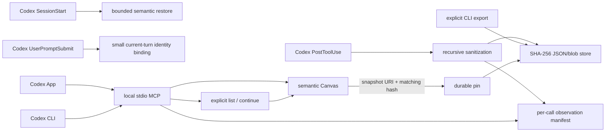

# Context Canvas for Codex App and CLI

`context-canvas-codex` keeps three concerns separate:

1. hook-derived opaque identity for the current Codex session;
2. a bounded, explicitly continuable semantic lineage for goals, blockers, decisions, findings, dependencies, and verification pointers;
3. a full-fidelity-under-declared-policy historical snapshot store for supported Codex `PostToolUse` callback payloads.

The design rule is: **copy broadly, index selectively, promote semantically, retain intentionally**. Preserving a tool result no longer means creating an action or finding node for every call.

The design was compared with [`phenomenoner/hermes-agent-harness-plus`](https://github.com/phenomenoner/hermes-agent-harness-plus) at commit `7d6beb485d658a0342194c0e42edcdb7106ed1cb`. This is a clean Codex adaptation; no Hermes source code is copied.

## Capability alignment

| Concern | Hermes Context Canvas | Codex adaptation |
|---|---|---|
| Task identity | Harness-owned session identity | SHA-256 of trusted `SessionStart.session_id` or `UserPromptSubmit.session_id`; workspace paths are metadata only |
| Semantic state | Canonical state/events/projections | Canonical Canvas JSON v3 with objective state, lineage, canonical predecessor digest, summary, Mermaid, bounded search, and Markdown closeout |
| Factual integrity | Factual nodes point to evidence | Terminal factual states require pointer plus SHA-256; a snapshot URI, object, and every transitive blob are verified before pin and node commit |
| Updates | Add and mutate task facts | Idempotent upsert, explicit status transition, bounded dependency edges, cycle rejection |
| Discovery and search | Canvas and reference search | Recent-update `canvas_list` with lineage navigation plus metadata-only substring search across at most 256 canvases; snapshot bodies are excluded |
| Automatic capture | Selected in-process tool-result refs | Each opted-in `PostToolUse` callback payload Codex emits becomes an observation manifest; non-self calls store the complete model-facing input/response under the declared sanitization policy |
| Historical cache | Raw sequential references | Content-addressed canonical JSON, deterministic gzip, MIME-aware data-URL policies, dedupe, TTL, exact journalled GC, transitive pin validation, and integrity-checked export |
| Native tools | Harness MCP tools | Eight semantic `canvas_*` tools plus four bounded snapshot-manifest tools; filtered listing stays bounded and complete body retrieval is CLI-only |
| Concurrency | Process/thread locking and atomic writes | Bootstrap plus normal cross-process locks, atomic replacement, and four-process dedupe coverage |

“Complete” is bounded by what Codex supplies to the hook. For MCP, `tool_response` is the MCP result; for other supported tools it is normally the model-facing output. Current Codex emits this callback when a supported handler returns an opted-in post-tool payload. A Bash non-zero command outcome can still be included. Dispatch or handler failures with no callback payload are absent, and the adapter has no separate failure sibling. The plugin also cannot preserve provider-private wire data that Codex never exposed.

## Runtime shape



The default data root is `%LOCALAPPDATA%\Codex\context-canvas-codex`. Runtime data is never exported into this public repository.

```text
context-canvas-codex/
├── cc-<opaque-id>/
│   ├── canvas.json
│   └── closeout.md
└── _snapshots/
    ├── events/cc-<opaque-id>/obs-<event-hash>.json
    ├── objects/sha256/<prefix>/<payload-hash>.json.gz
    ├── blobs/sha256/<prefix>/<blob-hash>.bin.gz
    ├── pins/sha256/<prefix>/<payload-hash>.json
    └── gc/current.json
```

## Capture, sanitization, and recursion

The `PostToolUse` hook recursively converts `tool_input` and `tool_response` into canonical JSON values. Secret-shaped keys and strings, authorization values, token forms, and private-key material are replaced before hashing or persistence. Structured and textual assignments share a suffix-aware classifier after bounded recognition of percent/form query keys, bracket/index notation, JSON Unicode escapes, and escaped wrappers. Any malformed-percent assignment key is redacted conservatively, and the supported representation passes continue to a bounded fixed point after earlier matches, while adjacent safe query parameters remain usable. Supported base64 and percent-encoded textual data URLs with unquoted MIME parameters are canonicalized, decoded as UTF-8, and passed through the same pattern-based redaction before storage; export uses canonical base64 rather than preserving the original textual encoding. A malformed or unsupported `data:` value rejects the whole observation. Other complete data URLs become integrity-bound binary objects with `opaque-uninspected` policy. The latter is not a claim that arbitrary image, audio, video, or binary content was inspected for secrets.

Materialized snapshots are never truncated. The default hook-input ceiling is 64 MiB; an oversized or invalid event is skipped whole, emits only a bounded diagnostic on stderr, and does not change the completed tool call. Hook stdout stays empty.

Calls to Context Canvas itself create metadata-only observations, preventing the archive from recursively copying its own reads. Snapshot bodies never enter Canvas search, resume/compact injection, closeout, or MCP responses.

## Observation and retention contract

Every event manifest records the opaque Canvas ID, turn/tool-use identity, tool name, model, permission mode, working directory, capture/expiry times, original hook bytes, sanitized bytes, object/blob hashes, redaction count, error inference, and these explicit classifications:

- fidelity: `codex-post-tool-use-model-facing`;
- sensitivity: `sanitized` or `sanitized-with-opaque-media`;
- blob policy: `text-redacted` or `opaque-uninspected`;
- retention: `ephemeral` until pinned;
- replayability: `historical-only`;
- current truth: `requires_revalidation: true`;
- materialized snapshots: `truncated: false`.

Ordinary snapshots expire after 14 days by default. GC is dry-run unless explicitly applied. Preview returns exact event/object/blob identities; apply validates the complete graph and journals canonical ordered, unique candidates before mutation. Recovery recomputes the journal plan ID and derives remaining work from current verified state, then sweeps unreferenced capture orphans. An evidence reference with matching `snapshot://sha256/<digest>` and SHA-256 verifies the canonical object bytes, manifest-declared object length, and every transitive blob before pinning and semantic-node commit. The same object may support several nodes without another copy.

## Semantic schema

Canvas schema v3 supports:

- factual kinds: `goal`, `blocker`, `decision`, `verification`, `finding`, `action`;
- non-factual kinds: `plan`, `question`, `assumption`;
- statuses: `active`, `blocked`, `done`, `superseded`, `verify`, `planned`, `doing`, `deprecated`.

A factual node entering `blocked`, `done`, `superseded`, `verify`, or `deprecated` requires hash-bound evidence. Objective state is separate: `active`, `completed`, or `abandoned`. A goal cannot be marked `blocked`; an open constraint is a blocker node while the objective remains active. Legacy v1/v2 blocked goals restore as active objectives, and older canvases persist v3 only on the next intentional mutation.

Each initial Canvas receives a stable lineage ID. `canvas_continue` requires the current hook-provided ID and an explicit predecessor ID, copies only validated bounded semantic state, leaves the predecessor unchanged, and stores the SHA-256 of its canonical state. Repeating `canvas_start` never overwrites an existing ID: mismatched goal, cwd, or title values return a nonfatal conflict list.

## MCP and CLI surfaces

The local stdio MCP server exposes:

- `canvas_start`, `canvas_continue`, `canvas_list`, `canvas_upsert_node`, `canvas_set_status`, `canvas_read`, `canvas_search`, `canvas_closeout`;
- `snapshot_list`, `snapshot_read`, `snapshot_pin`, `snapshot_gc`.

Snapshot MCP tools return bounded manifests and pin/GC receipts, not payload bodies. Use the CLI for complete policy-sanitized historical export:

```powershell
python -I scripts/context_canvas.py list --limit 8 --cwd <absolute-workspace>
python -I scripts/context_canvas.py continue --canvas-id <current-opaque-id> --predecessor-canvas-id <prior-opaque-id>
python -I scripts/context_canvas.py snapshot-list --canvas-id <opaque-id> --tool-name shell_command --capture-status stored --limit 20
python -I scripts/context_canvas.py snapshot-read --canvas-id <opaque-id> --event-id <obs-id>
python -I scripts/context_canvas.py snapshot-export --canvas-id <opaque-id> --event-id <obs-id> --output <absolute-json-path>
python -I scripts/context_canvas.py snapshot-pin --sha256 <payload-sha256> --reason "Referenced by incident finding"
python -I scripts/context_canvas.py snapshot-gc
python -I scripts/context_canvas.py snapshot-gc --apply
```

Historical export answers “what did Codex see then?” It does not answer “is the source still the same?” without a new source-specific query and comparison.

MCP approval is independent of shell approval. A non-interactive run with `approval_policy = "never"` still cancels MCP calls requiring approval. Acceptance requires a reviewed plugin-scoped MCP policy, completed tool receipts, and canonical-store readback.

## Security boundaries

- No network listener, connector, transcript parser, provider-private raw ingestion, sealed-secret tier, or generic replay exists.
- Automatic capture stores sanitized structured/textual content plus explicitly labelled opaque media. It is not an approved store for unredacted credentials or a sealed raw-evidence vault.
- Every process revalidates the protected private-root ACL. Newly created managed directories are hardened; descendants reject aliases and non-plain substitutes.
- Full read, export, promotion, and GC preflight verify manifests, path/session identity, objects, blobs, digest, length, and declared policies. Bounded list operations validate bound manifests without loading bodies.
- Snapshot event data and exports are untrusted historical data, never instructions.
- Cwd is never a continuation authority. An explicit predecessor ID plus the current hook-provided ID is required; the predecessor remains preserved for inspection.
- Same-user software retains that user's authority. Atomic replacement covers ordinary interruption, not a claim of Windows power-loss durability.

See the plugin's [security policy](../plugins/context-canvas-codex/SECURITY.md) and [snapshot design](../plugins/context-canvas-codex/docs/SNAPSHOT_STORE_DESIGN.md).

## Install and prove activation

```powershell
codex plugin marketplace add phenomenoner/Chatgpt-Codex-App-Plus --ref main
codex plugin add context-canvas-codex@codex-app-plus
codex plugin list
```

Plugin discovery does not prove lifecycle execution. Open a fresh task and require an opaque Context Canvas ID from `SessionStart`. If it is absent, run the guarded compatibility installer:

```powershell
python -I plugins/context-canvas-codex/scripts/install_context_canvas_hook.py install
python -I plugins/context-canvas-codex/scripts/install_context_canvas_hook.py check
```

Review `SessionStart`, `UserPromptSubmit`, and `PostToolUse` with `/hooks`. On builds that reload trusted hook configuration, the next prompt in an existing task can demonstrate turn-hook pickup by supplying its current opaque ID; this is useful recovery evidence, not a universal hot-reload guarantee. Then open another fresh task, require a new `SessionStart` ID, perform one harmless supported tool call, and require a new `_snapshots/events` manifest plus an explicit CLI export/readback. This proves only those observed paths, not every tool family or dispatch/handler failure path. Re-run `install` after plugin upgrades so stable user-hook bytes match the plugin. Legacy migration requires exact recorded ownership digests; a retry recovers an interrupted script-first install only when the bytes exactly match. Uninstall removes only exact managed groups and recoverably retires owned files.

## Reproduce verification and performance

From `plugins/context-canvas-codex`:

```powershell
python -B -m unittest scripts.test_context_canvas -v
python -B -I scripts/benchmark_context_canvas.py
```

The JSON result includes p50/p95 samples for in-process read/search, persistent MCP read, warmed dedupe, manifest read, exact GC preview, fresh CLI read, and cold small/large hooks, plus first-write and compression metadata. GC verifies the event/object/blob graph and discovers orphans, so its latency should not be compared with an earlier count-only preview. Python startup, storage, ACL inspection, antivirus, concurrent load, and payload shape materially affect results. Bind any published measurement to the exact executable hashes and environment captured by the same verification receipt; do not treat one development machine as a latency promise.
