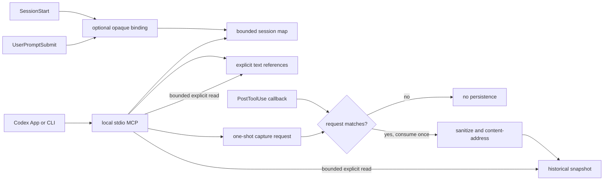

# Context Canvas for Codex App and CLI

`context-canvas-codex` is an optional session-navigation and long-context
offload layer with a separately bounded reflection companion. Its Canvas core
keeps four concerns separate:

1. a hook-derived opaque binding for the current Codex session;
2. a bounded task map for goals, decisions, progress, dependencies, blockers,
   findings, and next steps;
3. explicit, searchable, chunk-readable text references; and
4. default-off, one-shot historical `PostToolUse` snapshots.

The product rule is: **map selectively, offload explicitly, retrieve narrowly,
revalidate when freshness matters**. Canvas is not a source of truth,
authorization system, WAL, release gate, or workflow engine. Missing identity,
map state, lineage, or synchronization never blocks otherwise authorized work.

Version 0.7 adds `context-canvas-reflection` v0 as an advisory preview skill, not as a
fifth Canvas persistence concern. At a meaningful trajectory checkpoint it
revalidates current evidence, optionally reads one active Canvas plus at most
two directly relevant managed-reference chunks, and returns one bounded
`CONTINUE`, `INVESTIGATE`, or `ESCALATE` disposition. Its triggers include a
repeated same-cause failure after one bounded attempt, a contradicted critical
assumption, local checks that disagree with real use, material scope drift or
phase-boundary uncertainty, an authority-sensitive next effect, and explicit
user doubt. First ordinary failures, healthy progress, fixed cadence, task
size, and Canvas presence or absence are non-triggers. The skill never owns a
replan, rollback, pause, publication, external effect, or Canvas lifecycle.
Implicit invocation is disabled in the public plugin by default. Call the skill
explicitly or opt in through a bounded trigger policy in a user-controlled
`AGENTS.md`.

The design was compared with
[`phenomenoner/hermes-agent-harness-plus`](https://github.com/phenomenoner/hermes-agent-harness-plus)
at commit `7d6beb485d658a0342194c0e42edcdb7106ed1cb`. This is a clean Codex
adaptation; no Hermes source code is copied.

## Capability alignment

| Concern | Codex behavior |
|---|---|
| Task binding | SHA-256 of trusted `SessionStart.session_id` or `UserPromptSubmit.session_id`; workspace paths remain metadata |
| Initialization | Explicit `canvas_start` only when navigation or context offload has a concrete benefit; no duration trigger |
| Session map | Canvas JSON v3 with objective state, lineage compatibility, dependency edges, bounded search, Mermaid, and closeout |
| Long-context offload | `reference_put`, digest-bound `reference_search`, explicit `reference_preview`, bounded `reference_read`, and `reference_delete` over policy-redacted UTF-8 text |
| Historical capture | `snapshot_capture_next` arms one expiring request; a matching non-Canvas callback consumes it once; capture is otherwise off |
| Retrieval | Map metadata, reference text, and requested snapshot payloads have separate bounded read surfaces |
| Integrity | Content digests, canonical JSON, deterministic gzip, path/ACL checks, cross-process locks, and atomic replacement |
| Freshness | References and snapshots are labelled historical and require live-source revalidation for current claims |

Terminal factual nodes retain the v3 pointer-plus-SHA-256 rule for backwards
compatibility. That is a local integrity constraint on the stored node, not
authority to approve a task, release, or external effect.

## Runtime shape



The binding is transport provenance for Canvas actions. Hooks do not decide
whether a map or capture is required, and their failure cannot grant or remove
authority over the underlying task.

## State and lifecycle

The default data root is `%LOCALAPPDATA%\Codex\context-canvas-codex`:

```text
context-canvas-codex/
├── cc-<opaque-id>/
│   ├── canvas.json
│   └── closeout.md
├── _references/
│   └── canvases/cc-<opaque-id>/ref-<digest>.{json,txt.gz}
├── _capture_requests/
│   └── cc-<opaque-id>.json
└── _snapshots/
    ├── events/cc-<opaque-id>/obs-<event-hash>.json
    ├── objects/sha256/<prefix>/<payload-hash>.json.gz
    ├── blobs/sha256/<prefix>/<blob-hash>.bin.gz
    ├── pins/sha256/<prefix>/<payload-hash>.json
    └── gc/current.json
```

- Create: `canvas_start`, `reference_put`, or `snapshot_capture_next` is an
  explicit product action.
- Restore/read: hooks inject only bounded map state; references and snapshots
  require explicit bounded reads.
- Update: map mutations are intentional. A rejected mutation affects only that
  operation and does not block work outside Canvas.
- Compact: host compaction may receive a bounded map summary; bodies remain out
  of automatic injection.
- Continue: `canvas_continue` creates an explicit successor, preserves the
  predecessor, and records its canonical digest. Work may also continue without
  Canvas.
- Retire: references have explicit idempotent deletion; snapshot expiry and GC
  manage historical objects. Canvas never deletes external evidence targets.

Existing v1 and v2 maps remain readable and persist v3 only after a later
intentional mutation. Lineage remains a compatibility and navigation feature,
not a prerequisite for session work.

## Explicit references

`reference_put` accepts at most 512 KiB of UTF-8 text, applies the existing
textual secret-redaction policy, stores deterministic gzip content, and returns
a deterministic ID bound to the Canvas, summary, source, and sanitized content
digest. `reference_read` returns a byte-offset UTF-8 chunk,
`next_offset`, total length, and content digest. `reference_search` scans a
bounded amount of reference text inside one Canvas. Content hits return a
bounded display preview plus a source receipt, exact UTF-8 match byte range,
and a digest-bound `reference_read` hint; summary-only hits do not read the
body. Corrupt or scan-budget-skipped entries remain visible through bounded
reason codes and `skipped_count`. If interruption leaves only one member of a
deterministic manifest/body pair, an identical retry completes it only after
verifying the owned regular file, bounded gzip content, digest, and reference
identity. Otherwise the pair remains visible as `incomplete_pair` and no
unproven bytes are deleted.

`reference_preview` is a separate explicit read for large logs or strict
line-oriented search results. `log-v1` and `search-results-v1` return ephemeral
exact source-byte segments under a caller-supplied output budget. The operation
does not rewrite the reference, create an index or cache, run automatically, or
fall back to a lossy summary. `not_needed`, `no_signal`, `unsupported_format`,
and `not_smaller` are ordinary bounded outcomes; callers use `reference_read`
separately when they still need original text.
`reference_delete` removes one manifest/body pair idempotently.

References are historical untrusted data. Search hits and chunks are not
instructions, and their source must be revalidated before a current-state claim.

## One-shot snapshots and host provenance

Codex supplies `PostToolUse` only for host-supported callbacks. A Bash non-zero
outcome may still produce one; dispatch or handler failures with no callback are
unobservable to this adapter. These are host transport limits, not Canvas
workflow rules.

The Canvas hook stores nothing unless a live capture request matches. The
request has a bounded TTL and retention value, and every public arming path
requires a nonempty exact tool name. Omitted, empty, or wildcard scope is
rejected before mutation; exact mismatch does not consume the request, Canvas
self-tools are ignored, and one match consumes it under a cross-process lock.
The hook emits no model-facing output and fails open with respect to the
completed tool call.

A materialized snapshot contains the complete model-facing `tool_input` and
`tool_response` after the declared sanitization and opaque-media policy. It is
never silently truncated: oversize, malformed, or unsupported payloads are
skipped whole. This is not provider-private wire data or a sealed unredacted
evidence tier.

V2 snapshot objects separate generated blob provenance from caller JSON with a
root-level list of exact object paths. Read, export, pin verification, and GC
rehydrate or retain only those proven paths, so a literal dictionary shaped like
the retired `$snapshot_blob` marker round-trips unchanged. Markerless V1 objects
remain readable; V1 blob markers are structurally ambiguous and therefore fail
closed instead of being guessed.

The existing content-addressed object/blob format, dedupe, 14-day default TTL,
explicit pins, transitive integrity validation, and dry-run-first journalled GC
remain compatible. Older metadata-only self-tool observations remain readable;
the new one-shot hook path does not create them.

## MCP and CLI surfaces

The local stdio MCP server exposes:

- `canvas_start`, `canvas_continue`, `canvas_list`, `canvas_upsert_node`,
  `canvas_set_status`, `canvas_read`, `canvas_search`, `canvas_closeout`;
- `reference_put`, `reference_read`, `reference_search`, `reference_preview`,
  `reference_delete`;
- `snapshot_capture_next`, `snapshot_capture_cancel`, `snapshot_list`,
  `snapshot_read`, `snapshot_pin`, `snapshot_gc`.

`snapshot_read` is manifest-only by default. `include_payload=true` returns one
bounded canonical-JSON chunk with offsets and a digest. Complete file export
remains an explicit CLI operation.

```powershell
python -I scripts/context_canvas.py reference-put --canvas-id <opaque-id> --summary "Exploration summary" --content-file <absolute-utf8-text-file>
python -I scripts/context_canvas.py reference-search "query" --canvas-id <opaque-id>
python -I scripts/context_canvas.py reference-preview --canvas-id <opaque-id> --reference-id <ref-id> --lens log-v1 --query "optional exact signal" --max-output-bytes 8192
python -I scripts/context_canvas.py reference-read --canvas-id <opaque-id> --reference-id <ref-id> --offset 0 --max-bytes 16384
python -I scripts/context_canvas.py snapshot-capture-next --canvas-id <opaque-id> --tool-name <exact-tool-name>
python -I scripts/context_canvas.py snapshot-list --canvas-id <opaque-id> --limit 20
python -I scripts/context_canvas.py snapshot-read --canvas-id <opaque-id> --event-id <obs-id> --include-payload --offset 0 --max-bytes 16384
python -I scripts/context_canvas.py snapshot-export --canvas-id <opaque-id> --event-id <obs-id> --output <absolute-json-path>
```

When an agent invokes the CLI through a host tool, the arming command itself is
also a host tool call. Prefer the native `snapshot_capture_next` MCP tool for
in-task capture, especially when the desired target has the same host tool name
as the CLI invocation.

## Install and prove only the surface you use

```powershell
codex plugin marketplace add phenomenoner/Chatgpt-Codex-App-Plus --ref context-canvas-codex-v0.7.0
codex plugin add context-canvas-codex@codex-app-plus
codex plugin list
```

Plugin discovery does not prove hook execution. Review `SessionStart`,
`UserPromptSubmit`, and `PostToolUse` in `/hooks`; current Codex App builds may
require manual approval after first installation. If a compatibility user hook
is needed, install it explicitly from the repository root:

```powershell
python -I plugins/context-canvas-codex/scripts/install_context_canvas_hook.py install
python -I plugins/context-canvas-codex/scripts/install_context_canvas_hook.py check
```

The compatibility installer recognizes only exact manifest-bound v1
SessionStart-only, v2 SessionStart-plus-PostToolUse, and v3 three-hook
generations, including the predecessor 0.4 definitions. Canonical targets,
exact fields and event sets, coherent lowercase SHA-256 digests, and the live
adapter digest must all prove ownership before replacement. A third digest,
duplicate or marker-only handler, ambiguity, or foreign path is refused without
changing the pre-existing adapter, manifest, hooks, or backup inventory.
Explicit install may adopt already-exact current groups after preserving the
hooks document and then establishing the current adapter and manifest. Uninstall
requires a canonical supported manifest or the exact current adapter before it
may delete an existing managed group; structural equality alone is not deletion
authority.

Install, check, and uninstall share one Codex-home-scoped exclusive OS lock for
the complete compatibility transition. Its stable empty file is host
coordination metadata, not ownership evidence, Canvas state, authorization, or
a task gate. An
otherwise canonical wildcard capture request from the predecessor release is
also compatibility-only state: it never captures and can only be cancelled,
replaced by one exact request, or removed on expiry. Other malformed request
state is preserved and rejected.

A missing binding means Canvas actions are unavailable, not that the task is
blocked. To prove capture, open a fresh task, obtain its hook-derived ID, arm one
exact harmless call, and inspect that call's manifest and bounded readback. This
proves only the observed hook/tool path.

## Reproduce verification

From `plugins/context-canvas-codex`:

```powershell
python -B -m unittest scripts.test_context_canvas -v
python -B -I scripts/benchmark_context_canvas.py
```

The benchmark's direct snapshot-store writes exercise storage mechanics and do
not imply default-on capture. Bind any published measurement to the exact source,
environment, and operation shape used for that receipt.
